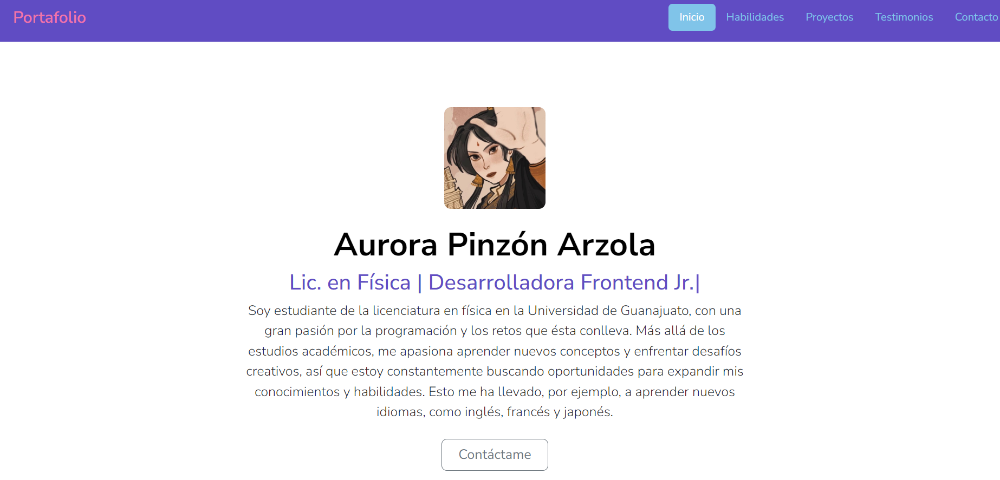

# Portafolio de Aurora Pinzón Arzola
## Proyecto responsivo realizado con Bootstrap 5 

Proyecto creado durante el bootcamp de Tecnolochicas PRO, es adaptable a distintos dispositivos y tamaños de pantalla. 

El propósito de esta página web es mostrar mi portafolio de proyectos como desarrolladora web.💜💻

Aquí puedes encontrar mi [Portafolio](https://borealis-aurora.github.io/) 👀

### Tecnologías 

* HTML
* CSS
* Bootstrap 
* JAVASCRIPT 

### El proyecto cuenta con las siguiente secciones: 

* Sobre mi
* Habilidades
* Proyectos 
* Testimonios
* Contacto

### Captura del proyecto

